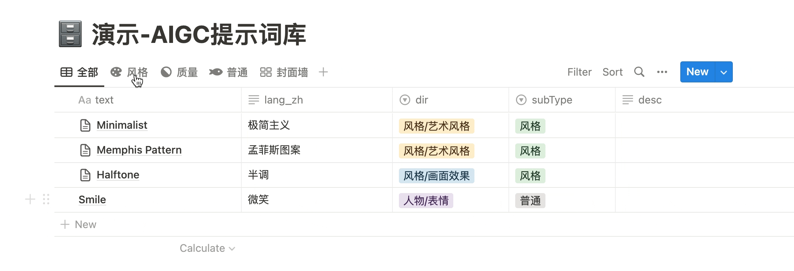
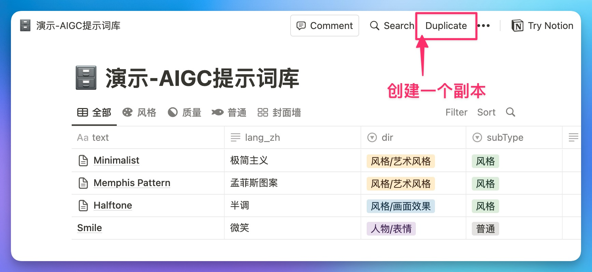
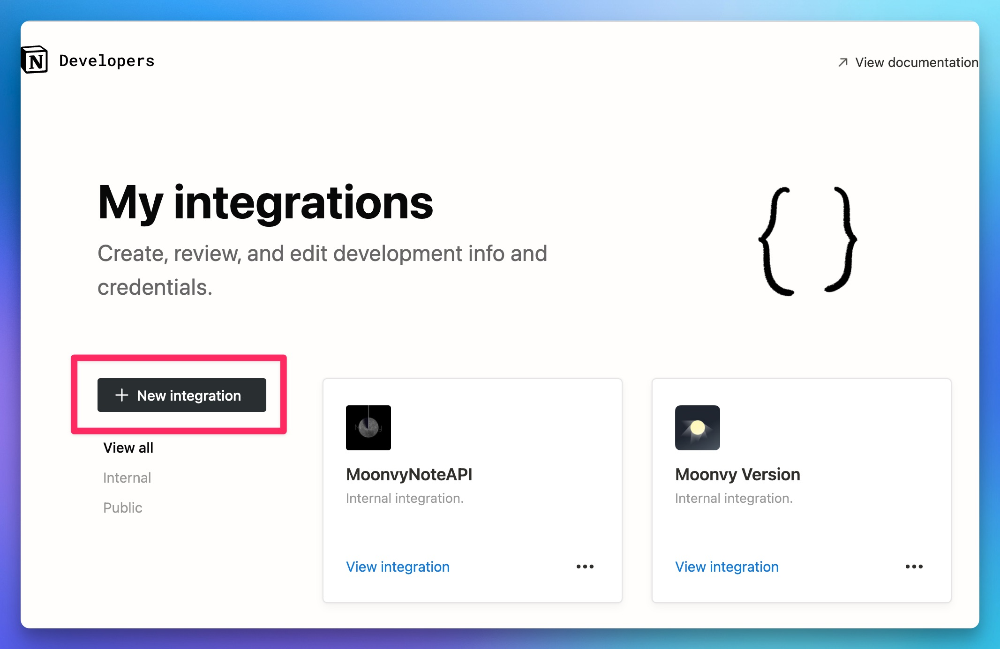
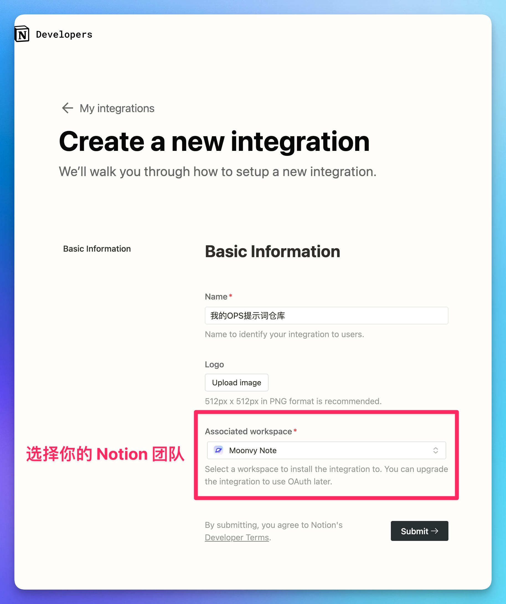
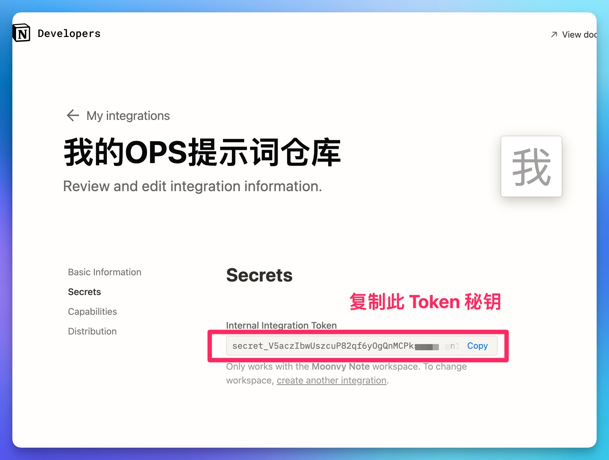

# 🥣 OPS/OpenPromptStudio

## 提示词工作室 | 可视化编辑提示词

<p align="center">
    
</p>

[**🥣 立即试试** moonvy.com/apps/ops/](https://moonvy.com/apps/ops/)

这是一个旨在把 AIGC 提示词（现在支持 Midjourney）可视化并提供编辑功能的工具，有以下特性

-   显示英文提示词的中文翻译
-   翻译输入的中文提示词到英文（因为 Midjourney 仅支持英文提示词）
-   为提示词进行分类（普通、样式、质量、命令）
-   轻松的排序、隐藏提示词
-   把提示词可视化结果导出为图片
-   常用提示词词典
-   通过 Notion 管理提示词词典

## 使用教程

<a href="https://www.bilibili.com/video/BV15N411P7D3/?spm_id_from=333.337.search-card.all.click&vd_source=1f6edbc8e03c44932da52d02c0c11c1c" target="_blank">
 
</a>

[📺 B 站视频教程](https://www.bilibili.com/video/BV15N411P7D3/?spm_id_from=333.337.search-card.all.click&vd_source=1f6edbc8e03c44932da52d02c0c11c1c)

## 如何连接的我的 Notion 来管理自己的词典

OPS 支持使用 [Notion](https://www.notion.so/) 来管理自己的词典，使用 Notion 管理相对简单，可自定义程度也很高。



### 1. 复制「演示-AIGC 提示词库」

复制我们的演示文档的自己的 Notion 工作区中

[**📕 演示-AIGC 提示词库**](https://moonvy.notion.site/b768c5c1852f4e2fbaee1b4a99f26d49?v=346e91e8114648c59079eeea2d9d56c7)

<p align="center">
    
</p>

保持表头定义： `text`, `subType`、`dir`、`lang_zh` 不要变（或者你可以新建一个 Notion 数据库，只要有这些表头 OPS 就能连接的这个数据库）

#### Notion 表头定义

| 表头    | 作用                                                    |
| ------- | ------------------------------------------------------- |
| text    | 提示词原文（不区分大小写）                              |
| lang_zh | 对应的中文翻译                                          |
| subType | 提示词在 OPS 中的分类（`普通`、`风格`、`质量`、`命令`） |
| dir     | 词典中的分类，子分类用`/`分隔如：`风格/绘画风格`        |
| alias   | 别名，可以有多个，用`,` 分隔                            |

### 2. 创建自己的 Notion 集成插件（integrations）

要让 OPS 连接到自己的 Notion 数据库，需要创建一个自己的集成（integrations）。OPS 会通过此集成的权限连接到你的数据库。

#### 2.1 打开集成开发页面

打开 Notion 的集成开发页面 [🔗 www.notion.so/my-integrations](https://www.notion.so/my-integrations)  
点击 「+ new integrations」按钮创建一个新集成插件

<p align="center">
    
</p>

#### 2.2 创建集成插件

在集成插件页面中选择允许访问的 Notion 工作区（Workspace），你的 Notion 数据库需要创建在此工作区下，OPS 才能通过集成插件访问。

<p align="center">
    
</p>

#### 2.3 获取集成插件 Token 密钥

集成插件创建完毕后，复制 Token 秘钥保存下来，你将使用此 Token 作为访问凭证，请妥善保管不要在公开场合泄露。

<p align="center">
    
</p>

#### 2.4 在数据库页面链接到你的集成

集成插件创建后，还需要在你的 Notion 数据库的菜单中连接到你的集成插件：

<p align="center">
    
</p>

### 3. 在 OPS 中配置 Notion

在 OPS 右上角打开提示词词典，鼠标放在「连接我的 Notion」按钮上，展开设置面板

-   「Integrations Token」 里面填入前面我们生成的集成 Token 秘钥（秘钥只会保存在浏览器本地（localStorage），不会被上传到任何地方）

-   「Database ID」里粘贴你 Notion 数据库的访问地址

-   然后点击「载入」按钮

<p align="center">
    
</p>

#### 获取 Notion 数据库的访问地址（`DatabaseID`）

在 Notion 数据库菜单中点击 「Copy link to view」 就可以了，粘贴 Notion 数据库地址到 OPS 的配置输入框后会自动提取 `DatabaseID`

<p align="center">
    
</p>


## 更好的体验

你可以在 [zeroG 浏览器](https://moonvy.com/zeroG/) 里让 OPS
与 Discord 在一个无限画布中使用，获得更好的体验


## 开发者

本地运行需要 NodeJS 环境

使用 `npm run start` 运行

运行打开后访问 `localhost:12833/apps/ops/`

### Docker
如果你不想安装 NodeJS 环境，可以使用 Docker 运行，参考 [./docker](https://github.com/Moonvy/OpenPromptStudio/tree/master/docker/)


### 如何修改默认提示词词典

1. 在 [./data/src](https://github.com/Moonvy/OpenPromptStudio/tree/master/data/src) 中编辑 `.csv` 文件，你可以用 Excel、Numbers 或者纯文本编辑器编辑。

2. 在 [Notion](https://www.notion.so/) 中编辑（[./data/src/notion/fromNotion.js](https://github.com/Moonvy/OpenPromptStudio/tree/master/data/src/notion/fromNotion.js) ）


### 翻译服务

在 `./server` 文件夹中有一个翻译服务的简单实现，调用腾讯翻译
你需要申请一个[腾讯机器翻译的账号](https://bobtranslate.com/service/translate/tencent.html)（每月免费额度 500 万字）  
然后在项目根目录创建一个 `.env` 文件写入你的的 `SECRET_ID` 与 `SECRET_KEY`

`.env`：

```node
TENCENT_SECRET_ID = "AKIDXXXXXXXXXXXXXXXXXXXXXXXXXXXXXXX"
TENCENT_SECRET_KEY = "a5XXXXXXXXXXXXXXXXXXXXXXXXXXXXXXXX"
```

然后运行 `npm run serve` 启动本地翻译服务
